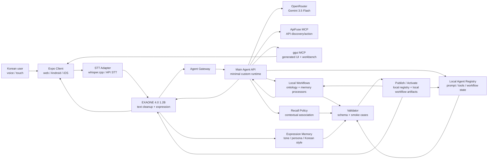
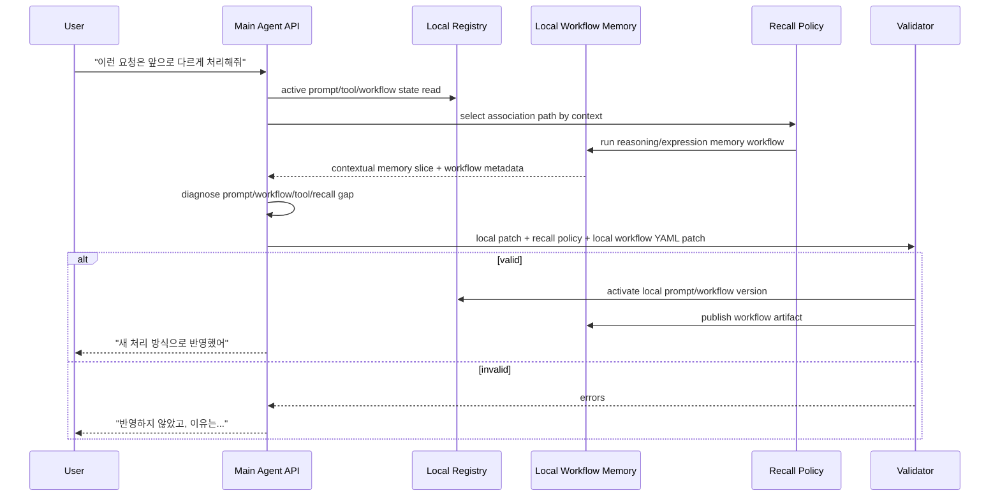

# 아키텍처

## 구성



## 핵심 원칙

- 사람 같은 에이전트성은 단순한 말투 프리셋이나 기억 저장량이 아니라, **에이전트 자신의 작업 경험과 실패 이력에 따라 기억을 다르게 떠올리고 그 연상법을 스스로 고치는 능력**에서 나온다.
- 문제의 중심은 memory storage가 아니라 recall policy다. 같은 온톨로지라도 어떤 관점으로 회상할지의 자유도가 필요하다.
- 기존 자기개선형 에이전트가 skill/workflow를 추가해 일하는 방식을 진화시키는 데 집중한다면, OBA는 recall policy를 수정해 기억을 떠올리는 방식을 진화시킨다.
- 메인 에이전트는 로컬 워크플로우 런타임 자체가 아니라 자체 API 런타임이다. 그래야 MCP/툴과 외부 API 호출을 오케스트레이션할 수 있다.
- 로컬 워크플로우 런타임 자체를 memory DB처럼 쓰는 것이 아니라, local workflow를 온톨로지/메모리 계층으로 설계한다. 결과는 JSON 또는 답변으로 받아 메인 에이전트 API가 다시 판단한다.
- 초기 에이전트는 작게 둔다. 도구와 MCP 표면이 성장의 출발점이다.
- EXAONE은 사용자와 만나는 텍스트 정리/발화/감성지능이다. 음성 인식 자체는 별도 STT adapter가 맡고, EXAONE은 STT 이후 텍스트 정리와 최종 출력의 말투/정서를 담당한다.
- `whisper.cpp`는 Mac/desktop MVP의 기본 로컬 STT 후보로 둔다. Android는 처음부터 로컬 STT에 묶지 않고 같은 STT adapter 뒤에서 API STT, 서버 STT, 온디바이스 STT를 교체 가능하게 둔다.
- Main Agent API는 판단/계획/툴 실행을 담당하는 이성지능이다.
- local workflow 안의 memory 역할은 EXAONE expression memory와 Main Agent reasoning memory로 분리한다. 표현 기억이 행동 결정을 넘겨받지 않고, 이성 기억이 사용자-facing 말투를 고정하지 않게 하기 위해서다.
- Obsidian vault는 지식저장소다. 최상위/core 문서는 항상 기억해야 하는 내용에 가깝게 취급하고, 길이 제한을 넘는 publish 후보는 split 후보를 먼저 만들도록 강제한다.
- ggui는 모바일/웹에서 에이전트가 직접 필요한 결과 UI를 띄우는 사용자-facing 렌더 표면이다. workflow runtime node가 아니고, 자기개선 과정을 사용자에게 보여주는 UI도 아니다.
- ApiFuse는 현실 API를 찾고 연결하는 행동 표면이다. 실행성 있는 액션은 confirmation token 없이 실행하지 않는다.

## 메인 에이전트 API

외부 구현체는 가져오지 않는다. 해커톤 MVP는 필요한 기능만 가진 얇은 API 서비스로 만든다.

- Node HTTP 서버 또는 얇은 Fastify/Express 서버
- 단일 `POST /turn` 진입점
- 작은 provider adapter: v1은 `codex-as-api` local OpenAI-compatible HTTP testbed, 이후 OpenRouter/FriendlyAI로 교체
- 고정된 초기 tool registry: `read`, `write`, `edit`, `bash` 네 개만 built-in으로 노출
- MCP adapter: streamable HTTP MCP를 server bootstrap에서 registry에 namespaced external tool로 붙임
- 한 턴 안에서만 도는 단순 tool loop
- prompt/tool schema version과 turn-local execution record
- 실패 시 명시적 에러와 롤백 가능한 candidate 파일

처음에는 queue, OAuth, Redis, DynamoDB, 복잡한 prompt cache, 장기 job orchestration을 넣지 않는다. 필요가 증명되면 나중에 붙인다.

## 런타임 레이어

### Expo Client

- push-to-talk 또는 음성 입력
- STT adapter를 통한 voice-to-text 변환
- transcript 확인/수정
- 에이전트 상태 표시
- ggui render surface
- ggui workbench surface
- 위험 액션 확인 UI
- web target 우선 개발, Android/iOS는 같은 React surface를 native shell로 실행

### STT Adapter

- EXAONE 앞의 입력창 역할만 맡는다.
- Mac/desktop MVP는 `whisper.cpp` `small`급 모델을 우선 후보로 둔다.
- Android MVP는 배터리, 발열, 모델 다운로드 부담 때문에 API STT 또는 서버 STT를 먼저 붙일 수 있게 한다.
- 출력 contract는 provider와 무관하게 `text`, `language`, `confidence`, `segments`, `provider`, `model`을 반환한다.
- STT 결과는 곧바로 행동으로 이어지지 않고, EXAONE이 한국어 문장 정리와 감정 힌트 추출을 한 뒤 Main Agent API로 넘긴다.

### EXAONE 소통/감성지능층

- 한국어 STT 결과 텍스트 정리
- 구어체를 작업 요청으로 정규화
- 짧은 로컬 의도 분류
- 민감한 발화의 외부 전송 전 redaction 후보 표시
- 메인 에이전트 API의 이성적 결과를 사용자에게 맞는 한국어 발화로 변환
- `exaone-expression-prompt.md`를 통해 말투, 공감 방식, 확인 질문 스타일을 진화 가능하게 관리
- expression memory 역할의 local workflow를 통해 호칭, 공감 강도, 번역투 보정, 설명 길이를 회상
- 사실 판단, 도구 실행, 안전 경계 결정은 하지 않음
- LM Studio의 로컬 EXAONE 4.0 1.2B 인스턴스를 기본 대상으로 삼고, 노드 프롬프트는 짧고 단순하게 유지함

### Main Agent API

- 강한 도메인 프리셋 없이 시작
- MCP/툴과 외부 API를 호출할 수 있는 유일한 메인 루프
- STT adapter와 EXAONE이 만든 입력 정규화 결과를 받아 판단하고, EXAONE에게 최종 표현 재작성 요청을 보냄
- reasoning memory 역할의 local workflow와 recall policy를 사용해 같은 단어라도 상황별로 다른 관점의 기억을 우선 회상
- 에이전트의 작업 경험, 실패 이력, 사용자 피드백을 바탕으로 recall policy candidate를 생성하고 검증
- 시스템 불변 규칙만 가진다:
  - 안전 경계
  - 자기수정 검증 루프
  - 도구 사용 원칙
  - 배포 전 테스트
- 자기개선은 사용자에게 노출되는 기능이 아니라 내부 후보 생성/검증/배포 루프다.
- 자기개선 구현은 Codex delegation을 사용하고, 기본 지시는 제품 의도/제약/acceptance criteria 수준으로 전달한다. 코드 레벨 지시는 기본값이 아니다.
- Codex skills, hooks, system prompt도 진화 대상이다. Hook 오류는 에이전트 프로세스를 죽이지 않고 진단 메시지로 삽입되어 다음 수정 후보의 입력이 된다.

### local workflow runtime Workflow Memory / Ontology Layer

로컬 워크플로우 런타임은 앱의 메인 에이전트가 아니다. 또한 로컬 워크플로우 런타임 자체를 일반적인 memory DB나 ontology store로 부르는 것도 정확하지 않다. OBA에서는 **local workflow를 온톨로지/메모리 계층처럼 설계**하고, 메인 에이전트 API가 호출하는 stateless 정보 가공 도구로 취급한다.

- ontology workflow: 업무 개념, 정책, 노드 metadata, 처리 방식, workflow catalog를 반환
- reasoning memory workflow: 작업 목적, 실패 패턴, 도구 선택 기준, 안전 제약, 사용자별 선호를 반환
- expression memory workflow: 말투, 호칭, 공감 방식, 한국어 어순/번역투 보정, 표현 선호를 반환
- recall policy workflow: 현재 상황에서 어떤 memory edge와 관점을 먼저 떠올릴지 결정하는 후보를 반환
- processor workflow: 입력을 받아 요약/분류/변환/검색 결과를 반환
- YAML artifact: 온톨로지/메모리 역할의 workflow를 import/export하고 검증/발행하는 배포 단위
- API contract: 메인 에이전트 API가 `workflow run` 또는 `chatflow` 결과를 받아 자기 컨텍스트에 넣는다

저장과 회상은 분리한다. 경험이 쌓이면 온톨로지 자체도 바뀌지만, 더 중요한 변화는 "무엇을 먼저 떠올리는가"다. 예를 들어 같은 "회의" memory도 보고서 작성, 팀 회고, 발표 준비에서는 서로 다른 edge를 우선 탐색해야 한다.



## ggui Workbench

ggui는 다음 네 가지 화면을 생성/갱신할 수 있어야 한다.

- Restaurant Photo Explorer: 사용자가 "이 식당 리뷰 사진 보여줘"라고 하면 검색/수집된 사진 결과를 모바일/웹에서 탐색 가능한 표면으로 표시
- Action Confirmation: ApiFuse 액션 실행 전 확인/보류 상태를 보여주되, token 없는 실행은 막음
- Result Review: workflow나 agent가 만든 renderer-neutral 결과를 카드/목록/사진 탐색 같은 UI로 표시
- Error/Fallback Surface: gateway가 실패해도 sample/fallback과 오류 상태를 분리해서 보여줌

ggui 이벤트는 structured event로 Main Agent API에 돌아갈 수 있지만, ggui 자체를 workflow node로 실행하지 않는다.

## 기본 MCP 세트

초기에는 두 개만 기본 탑재한다.

- ApiFuse MCP: 필요한 API 탐색, 스키마 조회, 실행 후보 구성
- ggui MCP: 모바일 화면에 맞는 UI 렌더링, 선택/확인 이벤트 수신

local workflow runtime는 MCP라기보다 workflow-as-memory/ontology adapter로 시작한다. archived vendor docs MCP는 빌드/운영 중 보조 도구로 쓸 수 있지만, 제품의 기본 사용자 기능으로 과하게 드러내지 않는다.

## 서버 계약 초안

`POST /turn`

```json
{
  "message": "앞으로 상품 주문은 비교표 먼저 보여주게 바꿔줘",
  "conversationId": "local-chat-id",
  "toolMode": "enabled",
  "metadata": {}
}
```

`audioText`, `transcript`, `turn.transcript`는 v1에서 거부한다. STT/EXAONE 입력 정규화 계층은 최종적으로 `message`를 만들어 Main Agent API에 넘긴다.

`POST /self/update`

```json
{
  "goal": "상품 주문 요청에는 후보 비교표와 확인 단계를 추가한다",
  "localState": {
    "promptVersionId": "active-local-prompt",
    "workflowRegistryVersion": "active-local-workflow"
  },
  "localOntologyYaml": "...",
  "evidence": {
    "failedTurns": [],
    "userInstruction": "..."
  }
}
```

응답:

```json
{
  "status": "candidate_ready",
  "summary": "주문 전 비교표 UI와 확인 노드를 추가했습니다.",
  "localPatch": "...",
  "localWorkflowYamlPatch": "...",
  "validation": {
    "passed": true,
    "checks": ["local_patch_parse", "yaml_parse", "required_tools", "smoke_turn"]
  }
}
```

## 구현 단계

1. 최소 Main Agent API 경계 정의
2. OpenRouter/Gemini provider adapter
3. ggui render surface PoC
4. ApiFuse MCP 탐색 PoC
5. local workflow-as-memory adapter와 YAML export/import 수동 루프 문서화
6. recall policy schema와 contextual association smoke case
7. 로컬 prompt/workflow registry candidate generator
8. local workflow YAML candidate generator
9. 통합 validator
10. 로컬 activate + local workflow runtime publish adapter
11. 같은 키워드의 상황별 회상 데모 시나리오 고정
