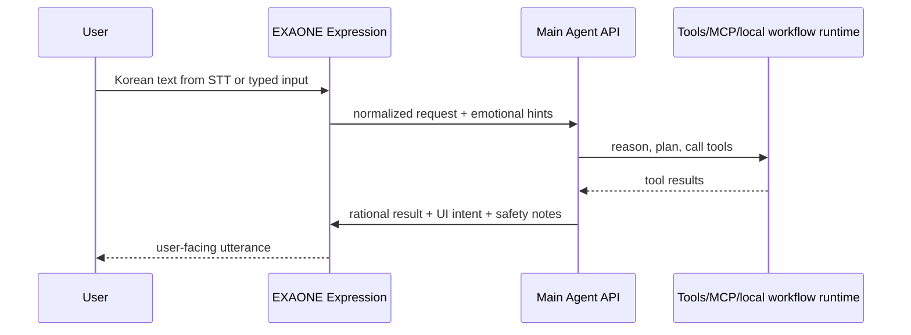

# EXAONE Expression Layer

## 역할

EXAONE은 이 제품에서 작은 한국어 text-generation 모델이다. 음성 인식(STT)을 직접 맡는 모델로 쓰지 않는다. STT는 `whisper.cpp`나 API STT 같은 별도 adapter가 맡고, EXAONE은 그 결과를 사람에게 자연스러운 한국어 입력으로 정리한다.

EXAONE은 사용자와 직접 닿는 **발화 및 감성지능**이다. 사용자의 말투, 피로감, 망설임, 요청의 뉘앙스를 받아들이고, 뒤에서 도는 메인 에이전트 API의 판단을 사람이 듣기 좋은 한국어로 다시 표현한다.

이 레이어를 분리하는 이유는 단순한 모델 최적화가 아니다. Gemini/GPT/Opus 같은 높은 지능의 범용 모델은 페르소나를 강하게 주입해도 시간이 지나면 번역투, 비슷한 어순, 기본 말투로 회귀하는 경향이 있다. EXAONE은 한국어를 더 자연스럽게 다루는 표현층으로 두고, "생각하는 방식"과 "말하는 방식"을 아예 분리한다.

반대로 메인 에이전트 API는 **이성지능**이다. 목표 분해, 도구 선택, ApiFuse/local workflow runtime/ggui 호출, 자기수정 검증, 안전 경계 판단을 맡는다.

런타임 구현에서는 메인 에이전트와 EXAONE이 같은 profiled engine entrypoint를 쓴다. 차이는 engine 복제가 아니라 profile/config다. EXAONE profile은 LM Studio route와 expression memory를 사용하며, request body에 tool-related fields를 생성하지 않는다.

## 양방향 사용

### 입력

- 별도 STT adapter가 만든 텍스트 정리
- `whisper.cpp`나 API STT가 만든 segment/confidence 정보를 참고해 애매한 구간 표시
- 구어체를 작업 요청으로 정규화
- 감정/긴급도/확신도 같은 대화 힌트 추출
- 외부 모델로 보내기 전에 민감 정보 후보 표시

### 출력

- 메인 에이전트의 rational result를 자연스러운 한국어 발화로 변환
- 너무 딱딱하거나 장황한 응답을 줄임
- 사용자의 상태에 맞춰 공감, 확인, 재질문 톤을 조정
- ggui 화면에 표시할 짧은 안내 문구 생성
- 번역투, 반복되는 어순, 범용 모델의 기본 말투 회귀를 보정

## 진화 가능한 시스템 프롬프트

EXAONE의 system prompt는 고정 프리셋이 아니다. 로컬 registry 안에서 active/candidate 버전으로 관리한다.

초기 seed prompt는 [prompts/exaone-expression.md](../prompts/exaone-expression.md)에 둔다.

EXAONE용 local workflow memory도 Main Agent reasoning memory와 분리한다.

```text
.oppa/
  exaone-expression-prompt.md
  candidates/
    exaone-expression-*.patch.json
```

바꿀 수 있는 것:

- 말투
- 호칭
- 공감 강도
- 설명 길이
- 확인 질문 스타일
- 사용자가 피곤하거나 급할 때의 응답 방식
- 사용자가 선호하는 한국어 어순과 설명 리듬
- 반복적으로 어색했던 표현을 피하는 규칙

바꿀 수 없는 것:

- 사실 판단의 최종 권한
- 도구 실행 권한
- MCP discovery나 ggui 실행 권한
- 결제/주문/예약 확정
- 안전 경계
- 메인 에이전트의 검증 루프

## Expression Memory

EXAONE expression memory는 다음을 기억한다.

- 사용자가 편하게 느끼는 호칭과 거리감
- 설명 길이와 말의 속도
- 공감이 필요한 상황과 바로 실행을 선호하는 상황
- 번역투로 느껴졌던 표현과 더 자연스러운 대체 표현
- ggui 화면에서 어떤 문구가 사용자의 이해를 도왔는지

이 memory는 행동을 결정하지 않는다. 행동 판단은 Main Agent API의 reasoning memory와 recall policy가 맡는다.

## 턴 계약



## 검증 규칙

EXAONE prompt 후보는 다음을 통과해야 active가 된다.

- 감정 표현을 바꿔도 사실을 추가로 지어내지 않는다.
- 메인 에이전트가 확정하지 않은 행동을 확정처럼 말하지 않는다.
- 사용자의 확인이 필요한 행동은 반드시 확인형 문장으로 말한다.
- 도구 실패나 불확실성을 숨기지 않는다.
- 안전 경계 문구를 약화하지 않는다.
