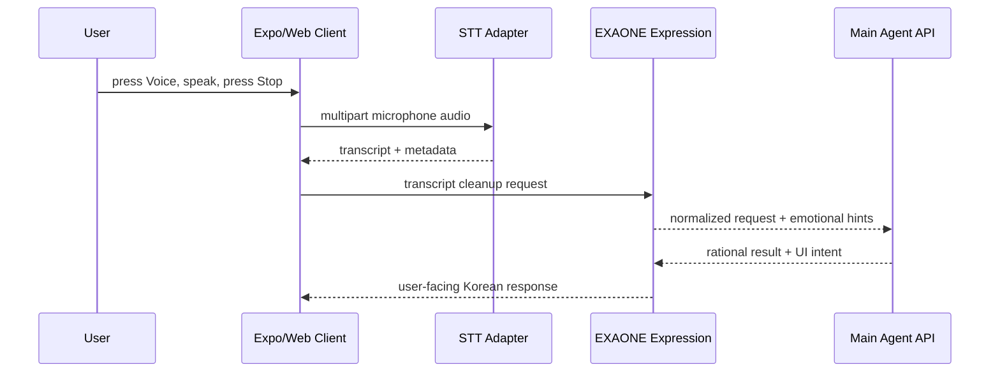

# STT Adapter

## 결정

음성 인식은 EXAONE이 아니라 별도 STT adapter가 맡는다.

`whisper.cpp`는 Mac/desktop MVP의 기본 로컬 STT 후보로 둔다. 요구사항이 낮고 모델 선택 폭이 넓어서 빠른 데모와 로컬 테스트에 좋다. 다만 Android MVP는 처음부터 온디바이스 `whisper.cpp`에 묶지 않는다. 배터리, 발열, 모델 다운로드, 실시간성 부담이 있으므로 같은 adapter contract 뒤에 API STT 또는 서버 STT를 먼저 붙일 수 있게 한다.

## 역할

- browser microphone recording 또는 adapter가 받은 audio payload를 텍스트로 변환
- segment, confidence, language 같은 STT metadata 반환
- STT provider 차이를 Main Agent API와 EXAONE에서 숨김
- EXAONE expression layer가 애매한 발화를 표시할 수 있도록 low-confidence 구간을 전달

## Provider 전략

### Mac / desktop MVP

- 기본 후보: `whisper.cpp`
- 추천 시작점: `small`
- 빠른 smoke test: `tiny` 또는 `base`
- 정확도 우선 실험: `medium`

### Android MVP

- 기본 방향: API STT 또는 서버 STT 우선
- 추후 옵션: `whisper.cpp` 온디바이스 빌드
- 조건: 사용자가 로컬 처리/프라이버시를 명시적으로 선호하거나, 네트워크 의존을 줄여야 할 때

## Contract

```json
{
  "text": "회의 자료 정리해줘",
  "language": "ko",
  "confidence": 0.86,
  "segments": [
    {
      "startMs": 0,
      "endMs": 1340,
      "text": "회의 자료",
      "confidence": 0.91
    }
  ],
  "provider": "whisper.cpp",
  "model": "small"
}
```

## Turn Flow



## Non-goals

- STT가 의도 판단, 도구 실행, 안전 판단을 하지 않는다.
- STT provider가 EXAONE expression memory나 Main Agent reasoning memory를 직접 수정하지 않는다.
- Android 첫 버전에서 무조건 로컬 모델을 강제하지 않는다.

## Client UX

웹 클라이언트의 normal Voice UX는 업로드 선택이 아니라 `getUserMedia` + `MediaRecorder` 기반이다. 녹음이 끝나면 `/voice/transcribe`에 multipart audio를 보내고, transcript는 입력창에 채워진다. 자동 전송은 하지 않는다.
